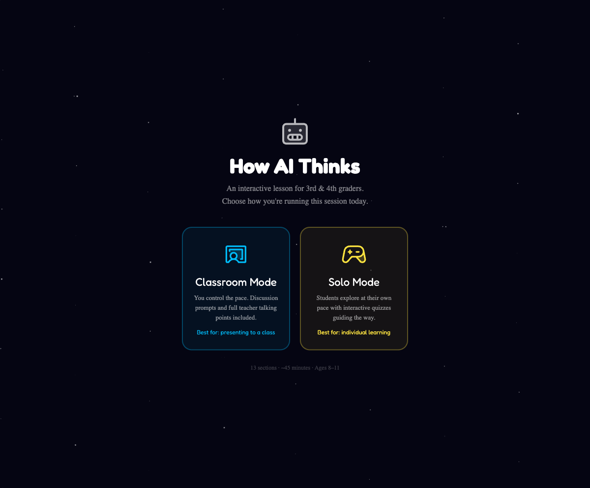
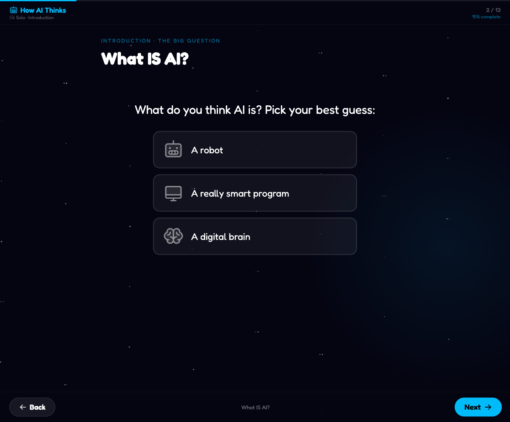
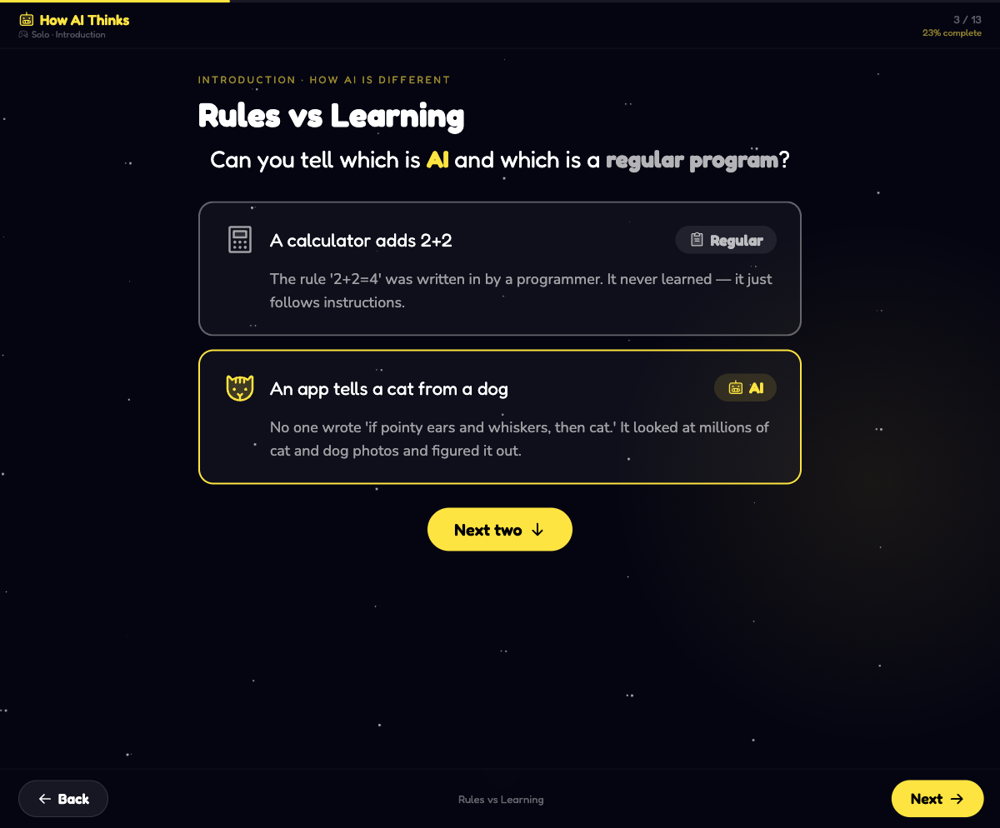
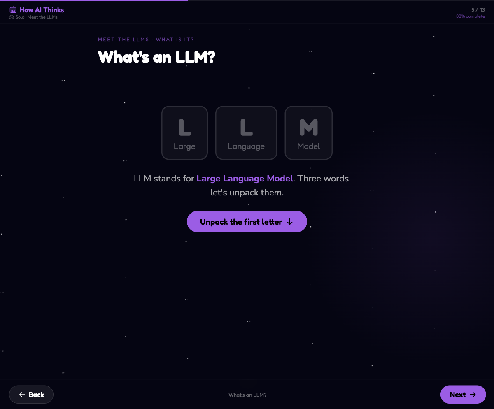
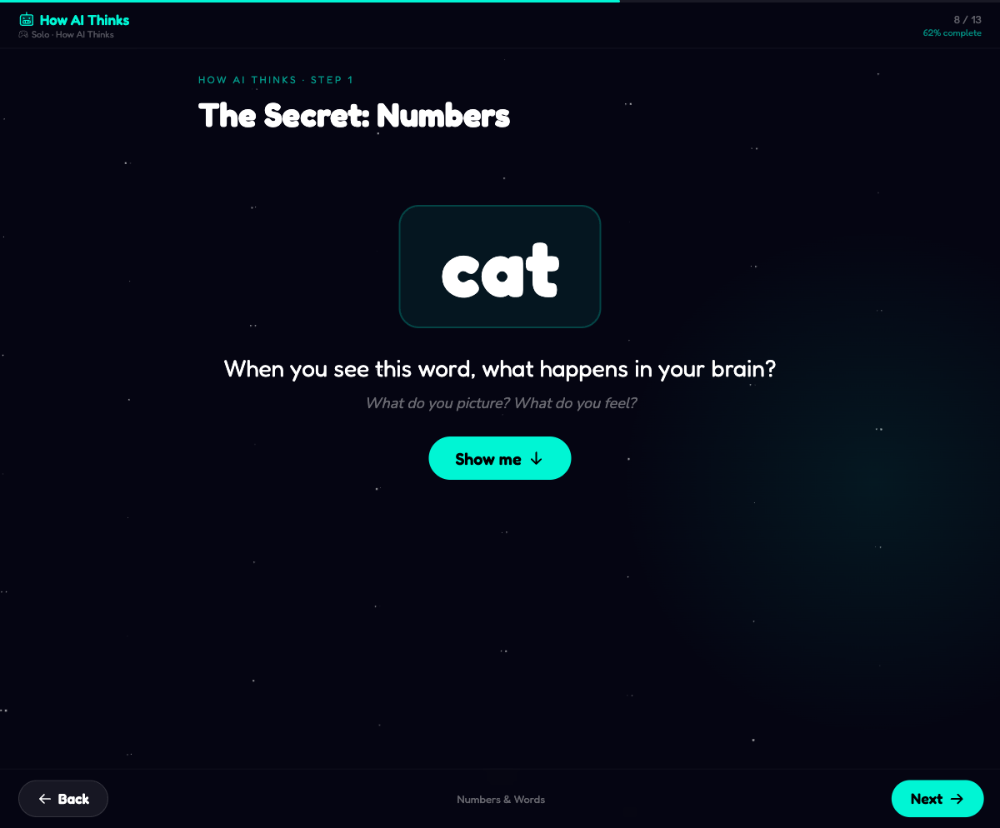
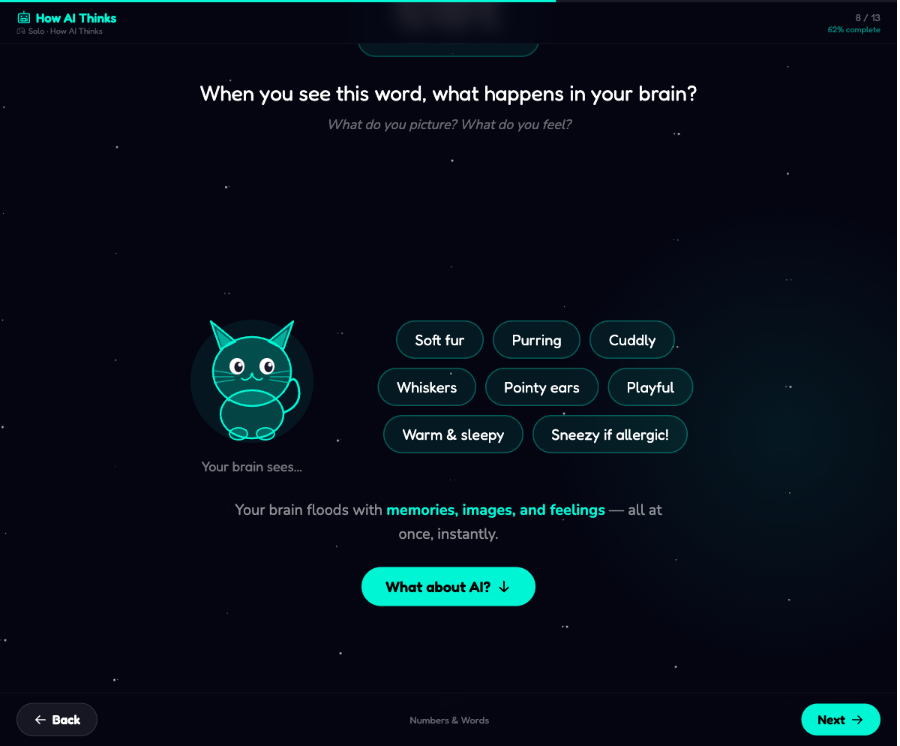
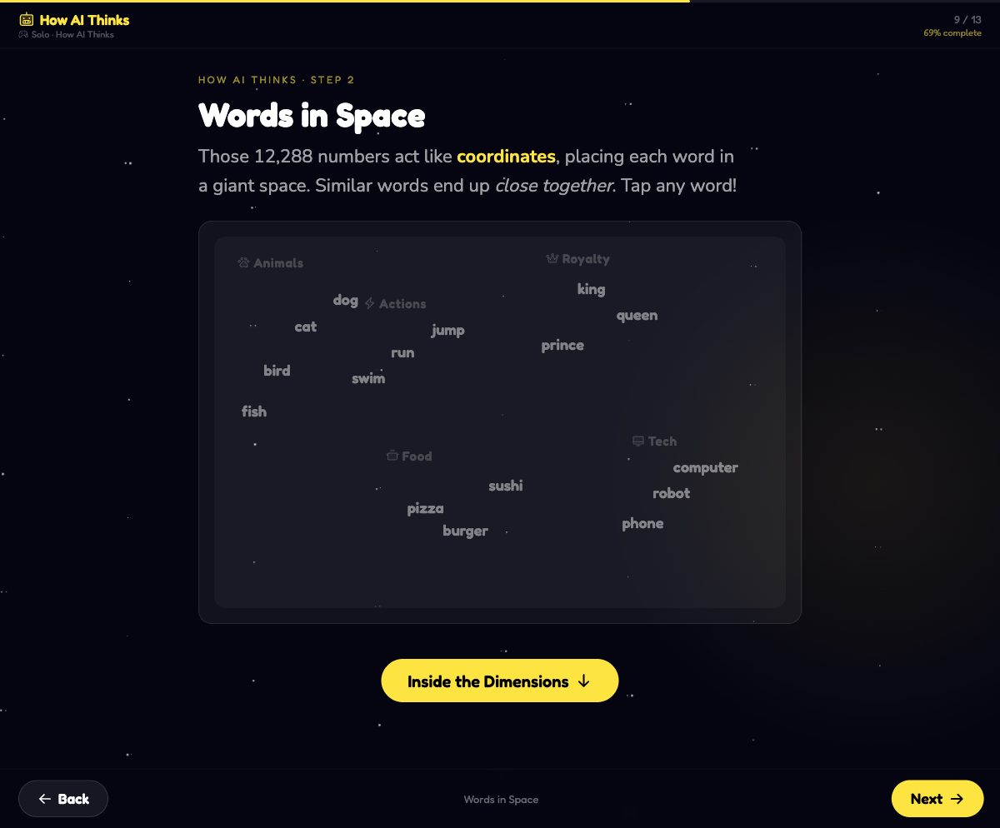
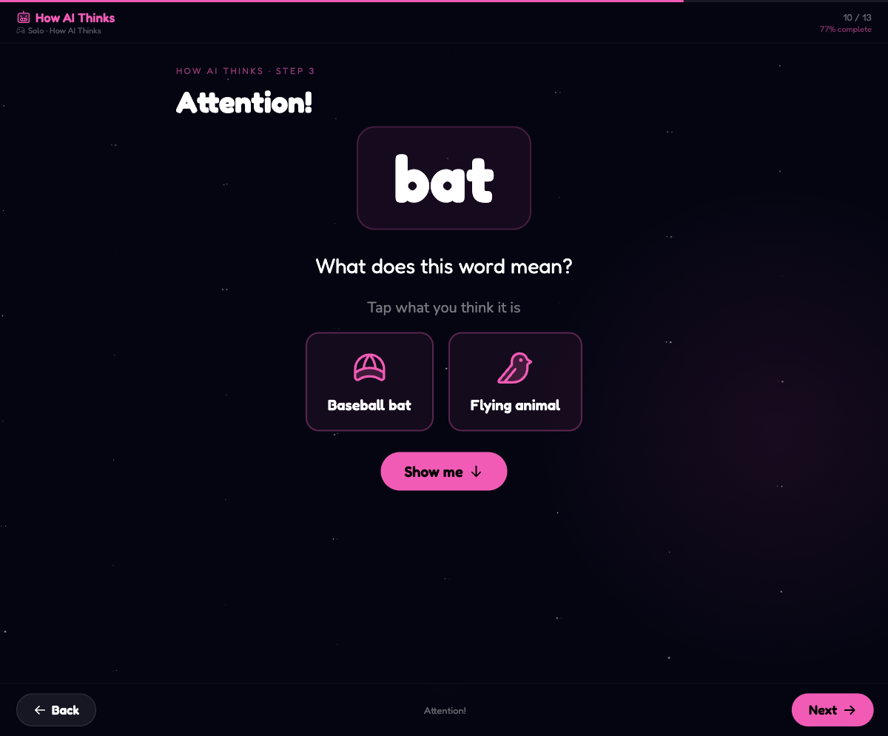
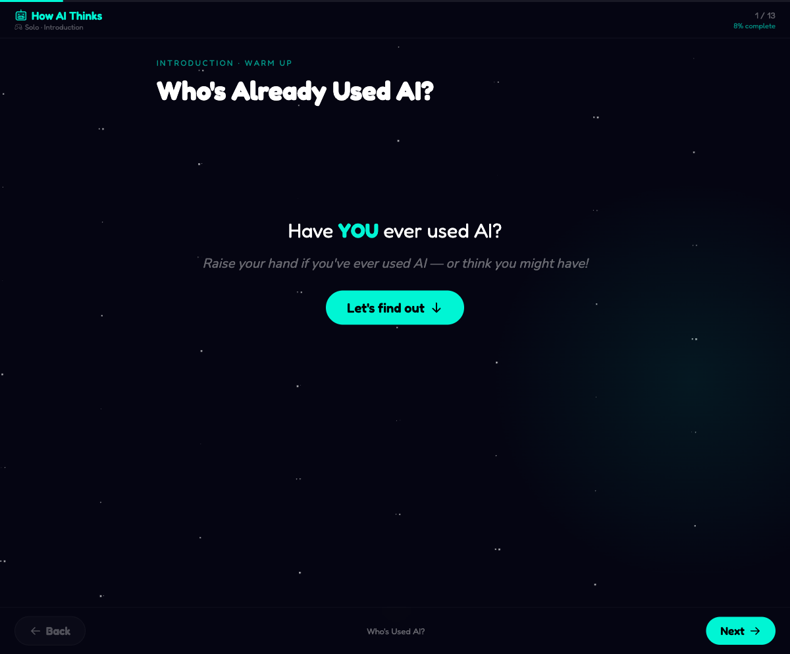

# I Know GenAI — How AI Thinks

An interactive, presentation-style web app that teaches 3rd–5th graders how large language models work. Built with React and designed to be projected in a classroom — everything is big, colorful, and visible from the back row.



## Two courses, one site

| | K-8 classroom course | 14+ course |
|---|---|---|
| **URL** | `/` (this page describes it) | [`/course`](https://iknowgenai.seibtribe.us/course) |
| **Title** | How AI Thinks | How AI Actually Works |
| **Audience** | Grades K-2 / 3-5 / 7-8, teacher-led or solo | Teens & adults, self-paced single track |
| **Style** | Big, colorful, playful (cat included) | 3Blue1Brown-style: serif, dark, restrained |
| **Shape** | Sections + grade bands + teacher notes | 15 chapters in 5 acts, ~110 min, final quiz |
| **Demos** | Real AI + guided visuals | Real AI + live in-browser math — "no simulations" is a stated promise |
| **Docs** | This README | [`docs/COURSE-14PLUS.md`](docs/COURSE-14PLUS.md) |

The 14+ course teaches what's *under the hood* — tokens, embeddings,
near-orthogonal superposition, attention, layers, temperature, reasoning
models, hallucination, RAG/tools/agents/MCP/skills — with every
simplification flagged in an "honest footnote," and ends with a
13-question quiz that explains every answer choice. Both courses share the
same API backend (`api/`); the code lives separately in `src/course/`.

## What It Teaches

The lesson walks students through 14 sections across three groups:

**Introduction** — What is AI? How is it different from regular programs? How does it compare to the human brain?

**Meet the LLMs** — What does LLM stand for? Meet ChatGPT, Claude, Llama, and Gemini. Then an animated overview shows how the entire pipeline works — a robot with a spinning crank processes "The cat sat on the ___" through 96 layers of attention and thinking, flashing questions like "Does a cat have fur?" and "What rhymes with cat?" before predicting "mat."

**How AI Thinks** — The six-step pipeline: how it learns (knock-knock jokes), numbers (embeddings), words in space (vector similarity), attention, the thinking layer (MLP with "21 Questions" framing), stacking 96 layers with flashing questions, and next-word prediction with a probability ranking.

### Highlights

| Section | What kids see |
|---|---|
| **The Secret: Numbers** | A giant "cat" prompt, then a streaming ticker of 12,288 numbers |
| **Words in Space** | An interactive scatter plot — tap words to see clusters light up |
| **Dimension Explorer** | Step through "Is Animal?", "Has Wings?", "You Can Ride It?" dimensions |
| **Attention** | "bat" — baseball bat or flying animal? Context decides |
| **The Thinking Layer** | "Ever play 21 Questions? What about 49,152 questions?" — MLP as brainstorm |
| **96 Layers** | Watch the full animation: attention beams + thinking questions cycle 96 times |
| **Predict!** | A ranked probability list shows how AI picks the next word, then a temperature slider |

## Screenshots

| | |
|---|---|
|  |  |
|  |  |
|  |  |
|  |  |

## Four Modes

- **Classroom Mode** — The teacher controls the pace. Each section includes collapsible "Talking Points" with discussion prompts and teaching tips.
- **Solo Mode** — Students explore at their own pace with interactive elements guiding the way.
- **Presentation Mode** — Full-screen, slide-by-slide with keyboard navigation (Right/Down/Space to advance, Left to go back). Designed for projecting to a class — no chrome, just content. 85+ slides across all sections.
- **Focus Mode** — Distraction-free view with minimal UI for concentrated learning.

## Resources

Accessible from the main mode-select screen:

- **Glossary** — 18 key AI terms with kid-friendly definitions, organized into 4 topic groups (Introduction, Words & Numbers, How AI Thinks, Output & Beyond)
- **Knowledge Check** — A 10-question multiple choice quiz testing core concepts. Answer all 10, then see color-coded results with explanations for any wrong answers. Retake anytime.

## Navigation

- **Down Arrow** or click the button — advance within a section (progressive reveal)
- **Left / Right Arrow** or click Back/Next — move between sections
- Each new step auto-scrolls into the center of the screen

## Installation

### Prerequisites

- [Node.js](https://nodejs.org/) v20.19+ or v22.12+
- npm (included with Node.js)

### Setup

```bash
git clone https://github.com/geseib/iknowgenai.git
cd iknowgenai
npm install
```

### Run locally

```bash
npm run dev
```

Open [http://localhost:5173](http://localhost:5173) in your browser.

### Build for production

```bash
npm run build
npm run preview
```

The built files will be in the `dist/` directory, ready to deploy to any static hosting service (GitHub Pages, Netlify, Vercel, S3, etc.).

## Tech Stack

- **React 19** — UI framework
- **Vite 7** — Build tool and dev server
- **Phosphor Icons** — Duotone icons throughout (no emoji)
- **No external CSS framework** — All styling is inline for simplicity
- **Vercel serverless functions** (`api/`) — real OpenAI-backed demos
  (generation, next-token prediction, tokenization, embeddings, agent loop)
  with layered content moderation; shared by both courses

## Project Structure

```
api/                       # Vercel functions: generate, predict, tokenize,
                           #   embed, annotate, agent, moderation (_moderate.js)
src/
  course/                  # The 14+ course ("How AI Actually Works") —
                           #   isolated app at /course; see docs/COURSE-14PLUS.md
  App.jsx                  # Root component, section navigation, keyboard handling
  components/
    shared.jsx             # Card, Label, H1, TriviaBox, TeacherNote, DiscussionGate
    CatIllustration.jsx    # Inline SVG cat illustration
    SectionWhoIsHere.jsx   # Section 1: Who's used AI?
    SectionWhatIsAI.jsx    # Section 2: What IS AI?
    SectionProgramsVsAI.jsx# Section 3: Rules vs Learning
    SectionBrainVsAI.jsx   # Section 4: Brain vs AI
    SectionWhatIsLLM.jsx   # Section 5: What's an LLM?
    SectionMeetModels.jsx  # Section 6: Meet the Models
    SectionTheBridge.jsx   # Section 7: The Big Question + animated pipeline overview
    SectionHowItLearns.jsx # Section 8: How It Learns (knock-knock jokes)
    SectionHook.jsx        # Section 9: The Secret: Numbers
    SectionEmbeddings.jsx  # Section 10: Words in Space + Dimension Explorer
    SectionAttention.jsx   # Section 11: Attention
    SectionMLP.jsx         # Section 12: The Thinking Layer (21 Questions)
    SectionLayers.jsx      # Section 13: Rinse & Repeat (96 layers with questions)
    SectionPredict.jsx     # Section 14: Predict! (probability list + temperature)
    Glossary.jsx           # Scrollable glossary of 18 key AI terms
    KnowledgeCheck.jsx     # 10-question multiple choice quiz with results
  data/
    constants.js           # Colors, section titles, group definitions
    embeddings.js          # Word map coordinates, dimension explorer steps
    predict.js             # Prediction demo data
  styles/
    global.js              # CSS animations (twinkle, fadeUp, slideIn, etc.)
```

## Submitting Issues

Found a bug, factual error, or have a suggestion?

1. Go to [Issues](https://github.com/geseib/iknowgenai/issues)
2. Click **New Issue**
3. Include:
   - What section the issue is in (e.g., "Section 9: Words in Space")
   - What you expected to happen
   - What actually happened
   - Your browser and device (especially if it's a display issue)

Factual accuracy matters here — if something is wrong or misleading for kids, please flag it.

## Contributing

Contributions are welcome! This is an educational project aimed at kids, so keep that audience in mind.

### Getting started

1. Fork the repository
2. Create a feature branch: `git checkout -b my-feature`
3. Make your changes
4. Test locally with `npm run dev`
5. Commit your changes: `git commit -m "Add my feature"`
6. Push to your fork: `git push origin my-feature`
7. Open a Pull Request

### Guidelines

- **Keep it kid-friendly** — Language should be simple and clear for 8–11 year olds
- **Keep it big** — All text, icons, and interactive elements must be visible from the back of a classroom
- **Keep it accurate** — All AI/ML concepts should be factually correct, even when simplified
- **Follow existing patterns** — Each section uses the same progressive reveal pattern (useState step + ArrowDown keyboard + scrollIntoView)
- **No external images** — Use Phosphor Icons or inline SVGs to avoid loading dependencies
- **Test both modes** — Check Classroom Mode (with talking points) and Solo Mode

### Ideas for contributions

- New sections covering topics like training data, hallucinations, or AI safety
- Accessibility improvements (screen reader support, high contrast mode)
- Translations / localization for other languages
- Mobile-friendly touch gestures
- Print-friendly handout versions of key visuals

## License

This project is open source. See the repository for license details.
